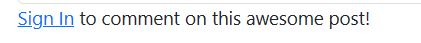
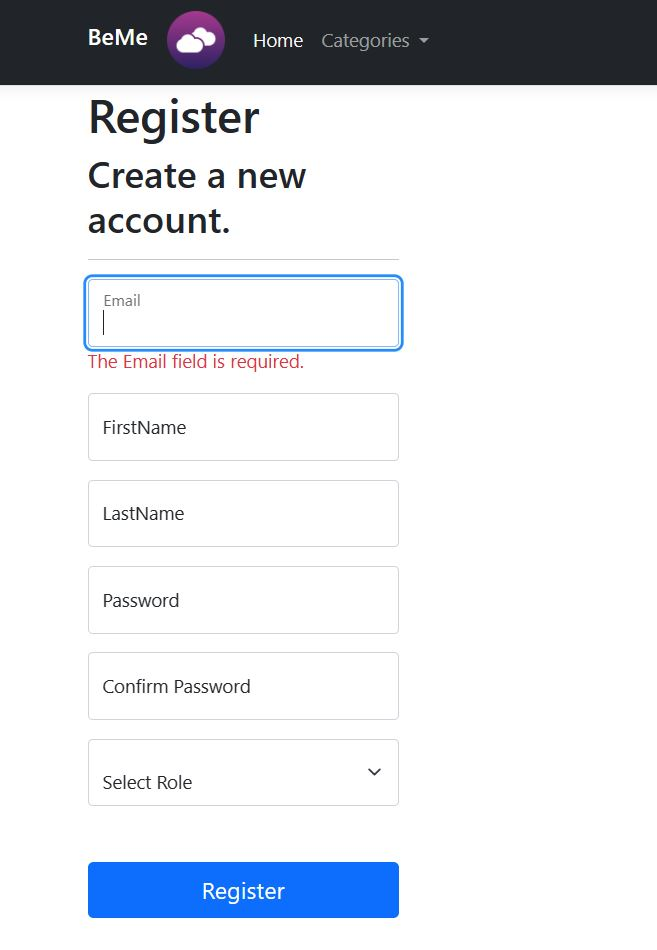
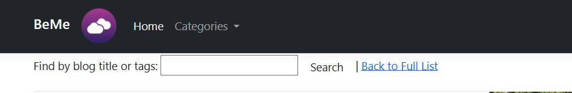

# COMP3000 PROJECT

# BeMe - a hobby-based social blogging platform 
### Supervisor: Vasilios Kelefouras
#### Ronia Palatty (10745379)

## Project Vision
RELEASE YOUR CREATVITY! My ambition is to provide an innovative outlet to view and share anything and everything you are passionate about. 
Broaden your perspectives and release your creative side, as that is what make us, us! 

### Welcome to BeMe! The aim of this project was to successfully develop a hobby-based social blogging platform, a web application that will enable users to create and publish blogs to share their hobbies and interests. 
### [BeMe demonstration video](https://youtu.be/ZhSWnRWcfFs)

## Admin side:

To access this, you need to log in using admin credentials. This is only used for monitoring and management purposes.

### Some key feautures include:
* User management
* Categories management
* Subcategories management
* Blog management

## Author side:

To access this, amke sure to select 'Author' in the role dropdown during account registration.
The main purpose of an author is to create and publish blogs. You can access your blogs using 'Blog' in the navigation bar.

## Subscriber side:

To access this, make sure to select 'Subscriber' in the role dropdown during account registration.
The main purpose of a subscriber is to view, interact with and support blog posts through comments and comment replies. Find your inspiration through these blogs.

## Home page:

This is where all published blogs will be displayed. Click on a blog card to expand and view all contents of the selected blog.
To view or add comments, you will need to log into your account.

Don't have an account? Register for one.

Use the search functionality at the top of the page to find blogs by title or tags, or use the 'Categories' dropdown to find blogs within that category.

## Hope you enjoy using BeMe!

